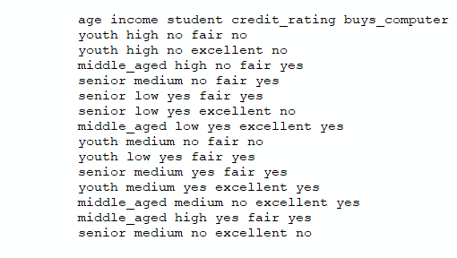
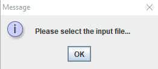
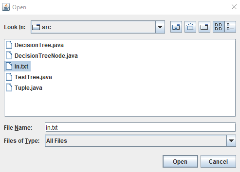
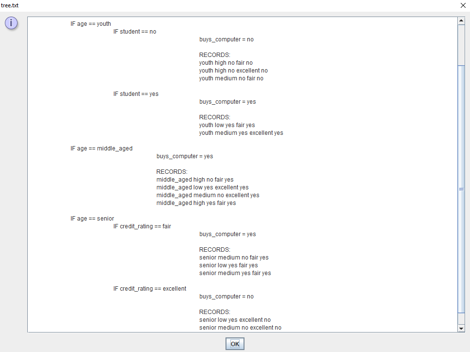
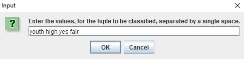
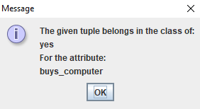

# [Decision Tree Generator](https://github.com/adelgado0723/portfolio/tree/master/DecisionTreeGenerator/src)

- Decision Trees are a way of finding correlations in people's behavior from
  data about their habits. 
		
	- Examples:	
		- The majority of customers that buy diapers, buy beer as well
		- The majority of customers that are students, regardless of
		  credit, buy a laptop computer

- Builds a decision tree based on a provided input file
	
- Proceeds to classify a tuple of data based on the decision tree.

## Sample input is provided

## User Prompted to Select Input File

### Prompt

### File id Chosen

## Decision Tree is Printed

## Query Tuple is Provided

## Prediction is Printed

## Demo

